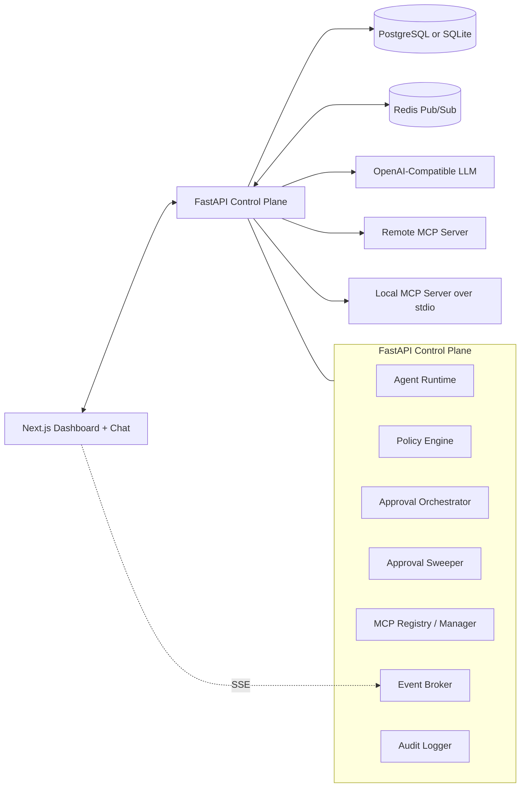

# Architecture

## Summary
- Build a guarded AI agent that discovers tools from MCP servers at runtime.
- Put a policy engine between model intent and tool execution.
- Use a Next.js dashboard as the live control plane for policies, approvals, logs, and MCP visibility.
- Keep the system split into three clear layers:
  - agent runtime
  - control plane
  - MCP servers
- Treat policy enforcement as the authoritative boundary, including after a human approval has already been queued.

## What We Are Solving
- Dynamic MCP tool discovery and execution.
- Deterministic policy enforcement before any tool call runs.
- Live policy updates without restarting the backend.
- Human approval for sensitive tools.
- Approval invalidation when policy changes after an approval request was created.
- Automatic approval expiry with default deny.
- Budget enforcement for long-running conversations.
- Auditable logs for model actions, policy verdicts, approvals, and tool results.

## What We Are Not Solving
- Full cryptographic intent verification.
- Enterprise auth, multi-tenancy, RBAC, or SSO.
- A general autonomous planning platform.
- Perfect semantic detection of prompt injection from free text alone.
- Production-scale distributed orchestration.

## Core Principles
- Policy is the product core, not a helper.
- The model may propose actions; the system decides execution.
- Tool lists are discovered from MCP servers, never hardcoded in the reviewed runtime path.
- Enforcement is based on structured tool intent, not model reasoning text.
- Approval is not permanent authority; the latest policy still wins at execution time.
- Every meaningful step is logged.

## Chosen Stack
- Frontend: Next.js
- Backend: FastAPI
- Database: PostgreSQL primary, SQLite fallback for local-only development
- Realtime coordination: Redis pub/sub with in-process fallback
- LLM provider: OpenAI-compatible function-calling planner by default, mock planner only for explicit local demos
- MCP servers:
  - one remote MCP server
  - one custom MCP server

## High-Level Design

## Main Runtime Flow
1. User sends a message from the chat UI.
2. Agent runtime loads current discovered tools from active MCP servers.
3. The LLM either answers directly or requests a tool call.
4. The runtime converts the request into a `ToolExecutionIntent`.
5. The policy engine returns `ALLOW`, `BLOCK`, or `REQUIRE_APPROVAL`.
6. If allowed, the MCP manager executes the tool and returns the result to the loop.
7. If blocked, the agent receives a structured denial and continues safely.
8. If approval is required, the run pauses and a pending approval is created.
9. An admin approves or denies from the dashboard.
10. On approval, the same tool call is evaluated again against the latest policy state before execution.
11. If the policy changed to `BLOCK`, the approval is marked superseded and the tool does not run.
12. A background sweeper expires stale approvals and denies the run automatically.
13. All steps are written as audit events and streamed to the dashboard.

## Components

### Agent Runtime
- Owns the LLM tool-use loop.
- Maintains run and conversation state.
- Requests the live tool catalog from the MCP manager.
- Enforces budgets before and after planner usage is recorded.
- Never executes tools without policy evaluation, including resumed approvals.

### MCP Registry / Manager
- Stores configured MCP servers.
- Connects through `stdio`, `sse`, or `streamable_http`.
- Discovers tools dynamically.
- Normalizes tool metadata into a shared internal catalog.

### Policy Engine
- Separate, deterministic decision module.
- Inputs:
  - conversation and run context
  - tool name
  - MCP server id
  - tool arguments
  - token and cost counters
- Outputs:
  - verdict
  - matched rule ids
  - reason
  - approval requirement if applicable
- Path validation normalizes relative POSIX-style paths before allow-prefix checks.

### Approval Orchestrator
- Creates pending approvals.
- Publishes pending state to the dashboard.
- Resumes or terminates paused runs after admin action.
- Re-checks policy before running an approved tool call.
- Applies TTL and default deny on expiry.

### Approval Sweeper
- Runs in the API lifespan as a background task.
- Scans for expired pending approvals.
- Marks the run denied and emits `approval.expired` events.

### Event Broker and Audit Logger
- Logs:
  - user messages
  - model outputs
  - tool intents
  - policy decisions
  - approvals
  - tool results
  - tool failures
- Publishes audit-style events to the dashboard through Redis pub/sub when configured, or in-process queues for local single-instance mode.

### Custom MCP Server
- Sandboxed file workspace MCP server.
- Tools:
  - `list_files`
  - `read_file`
  - `write_file`
  - `delete_file`
  - `search_files`
- This server demonstrates block, approval, path restriction, and audit flows clearly.

## Key Design Choices

### Custom agent loop over heavy agent framework
- Choice: thin custom loop.
- Why:
  - keeps the policy seam explicit
  - avoids hidden framework behavior
  - is easier to explain in review and demo

### Next.js over Streamlit
- Choice: Next.js.
- Why:
  - better fit for a control-plane UI
  - stronger support for multiple screens and richer state
  - better product signal for an ArmorIQ-style workflow

### FastAPI backend
- Choice: single Python backend.
- Why:
  - strong fit for agent runtime and MCP integration
  - simple async APIs
  - easy to keep agent, policy, and orchestration modular

### SSE plus Redis pub/sub over frontend polling
- Choice: server-sent events backed by Redis when available.
- Why:
  - stronger live-control story for logs, approvals, and policy changes
  - works across multiple API workers when Redis is enabled
  - still degrades cleanly to local in-process mode

### Live policy lookup on every tool decision
- Choice: evaluate current enabled policies at execution time instead of caching a snapshot.
- Why:
  - makes dashboard changes effective immediately without restart
  - prevents stale approvals from bypassing newly-added rules
  - keeps the policy seam easy to reason about in review

### Reviewed runtime defaults to a real LLM
- Choice: the documented path uses the OpenAI-compatible planner.
- Why:
  - removes dependence on hardcoded demo behavior
  - keeps tool use aligned with live MCP discovery and tool schemas
  - makes the assignment story stronger in review

## Policy Model
- Rule types:
  - block tool
  - require approval
  - validate arguments
  - token budget
  - cost budget
- Precedence:
  - `BLOCK` > `REQUIRE_APPROVAL` > `ALLOW`
  - more specific rule beats broader rule
  - explicit priority breaks ties

## Data Model
- `mcp_servers`
- `discovered_tools`
- `policies`
- `conversations`
- `runs`
- `approval_requests`
- `audit_events`

## Realtime Behavior
- Policy and approval changes are written to the database.
- Audit and lifecycle events are published through Redis pub/sub when configured.
- The frontend subscribes over SSE and refreshes the affected views.
- The runtime does not rely on cached policy snapshots; the next tool decision reads current enabled policies directly.

## Edge-Case Stance
- MCP server crash mid-call:
  - return a structured tool failure
  - do not blindly retry mutating tools
- Prompt injection:
  - never treat model reasoning as authority
  - enforce only on structured tool intent and arguments
- Rule conflicts:
  - deterministic precedence, never first-match-wins
- Approver offline:
  - pending approvals expire after TTL
  - default deny on expiry

## Repo Shape
- `web/` - Next.js app
- `api/` - FastAPI backend
- `mcp_server/` - custom MCP server
- `docs/` - extra notes and demo material
