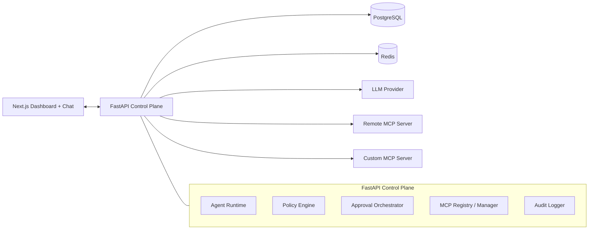

# Architecture

## Summary
- Build a guarded AI agent that discovers tools from MCP servers at runtime.
- Put a policy engine between model intent and tool execution.
- Use a Next.js dashboard as the live control plane for policies, approvals, logs, and MCP visibility.
- Keep the system split into three clear layers:
  - agent runtime
  - control plane
  - MCP servers

## What We Are Solving
- Dynamic MCP tool discovery and execution.
- Deterministic policy enforcement before any tool call runs.
- Live policy updates without restarting the backend.
- Human approval for sensitive tools.
- Auditable logs for model actions, policy verdicts, approvals, and tool results.

## What We Are Not Solving
- Full cryptographic intent verification.
- Enterprise auth, multi-tenancy, RBAC, or SSO.
- A general autonomous planning platform.
- Perfect semantic detection of prompt injection from free text alone.
- Production-scale distributed orchestration.

## Core Principles
- Policy is the product core, not a helper.
- The model may propose actions; the system decides execution.
- Tool lists are discovered from MCP servers, never hardcoded in the runtime.
- Enforcement is based on structured tool intent, not model reasoning text.
- Every meaningful step is logged.

## Chosen Stack
- Frontend: Next.js
- Backend: FastAPI
- Database: PostgreSQL
- Realtime coordination: Redis
- LLM provider: adapter-based, provider swappable
- MCP servers:
  - one remote MCP server
  - one custom MCP server

## High-Level Design

## Main Runtime Flow
1. User sends a message from the chat UI.
2. Agent runtime loads current discovered tools from active MCP servers.
3. The LLM either answers directly or requests a tool call.
4. The runtime converts the request into a `ToolExecutionIntent`.
5. The policy engine returns `ALLOW`, `BLOCK`, or `REQUIRE_APPROVAL`.
6. If allowed, the MCP manager executes the tool and returns the result to the loop.
7. If blocked, the agent receives a structured denial and continues safely.
8. If approval is required, the run pauses and a pending approval is created.
9. An admin approves or denies from the dashboard.
10. All steps are written as audit events.

## Components

### Agent Runtime
- Owns the LLM tool-use loop.
- Maintains run and conversation state.
- Requests the live tool catalog from the MCP manager.
- Never executes tools without policy evaluation.

### MCP Registry / Manager
- Stores configured MCP servers.
- Connects through `stdio` or `SSE`.
- Discovers tools dynamically.
- Normalizes tool metadata into a shared internal catalog.

### Policy Engine
- Separate, deterministic decision module.
- Inputs:
  - conversation and run context
  - tool name
  - MCP server id
  - tool arguments
  - token and cost counters
- Outputs:
  - verdict
  - matched rule ids
  - reason
  - approval requirement if applicable

### Approval Orchestrator
- Creates pending approvals.
- Publishes pending state to the dashboard.
- Resumes or terminates paused runs after admin action.
- Applies TTL and default deny on expiry.

### Audit Logger
- Logs:
  - user messages
  - model outputs
  - tool intents
  - policy decisions
  - approvals
  - tool results
  - tool failures

### Custom MCP Server
- Recommended v1 theme: sandboxed file workspace.
- Tools:
  - `list_files`
  - `read_file`
  - `write_file`
  - `delete_file`
  - `search_files`
- This is the clearest fit for demonstrating block, approval, and path guardrails.

## Key Design Choices

### Custom agent loop over heavy agent framework
- Choice: thin custom loop.
- Why:
  - keeps the policy seam explicit
  - avoids hidden framework behavior
  - is easier to explain in review and demo

### Next.js over Streamlit
- Choice: Next.js.
- Why:
  - better fit for a control-plane UI
  - stronger support for multiple screens and richer state
  - better product signal for an ArmorIQ-style workflow

### FastAPI backend
- Choice: single Python backend.
- Why:
  - strong fit for agent runtime and MCP integration
  - simple async APIs
  - easy to keep agent, policy, and orchestration modular

### Redis push invalidation over polling
- Choice: push policy changes to the running backend.
- Why:
  - stronger live-control story
  - keeps dashboard changes effective immediately
  - avoids slow polling windows

### Default allow with explicit guardrails
- Choice: default allow for v1.
- Why:
  - easier demo UX
  - less setup friction
  - still shows policy power clearly

## Policy Model
- Rule types:
  - block tool
  - require approval
  - validate arguments
  - token budget
  - cost budget
- Precedence:
  - `BLOCK` > `REQUIRE_APPROVAL` > `ALLOW`
  - more specific rule beats broader rule
  - explicit priority breaks ties

## Data Model
- `mcp_servers`
- `discovered_tools`
- `policies`
- `conversations`
- `runs`
- `approval_requests`
- `audit_events`

## Realtime Behavior
- Policy changes are written to Postgres.
- Backend publishes a policy-version event through Redis.
- Active runtimes invalidate cached policy snapshots.
- The next tool intent uses the latest policy without restart.

## Edge-Case Stance
- MCP server crash mid-call:
  - return a structured tool failure
  - do not blindly retry mutating tools
- Prompt injection:
  - never treat model reasoning as authority
  - enforce only on structured tool intent and arguments
- Rule conflicts:
  - deterministic precedence, never first-match-wins
- Approver offline:
  - pending approvals expire after TTL
  - default deny on expiry

## Repo Shape
- `web/` - Next.js app
- `api/` - FastAPI backend
- `mcp_server/` - custom MCP server
- `docs/` - extra notes and demo material
